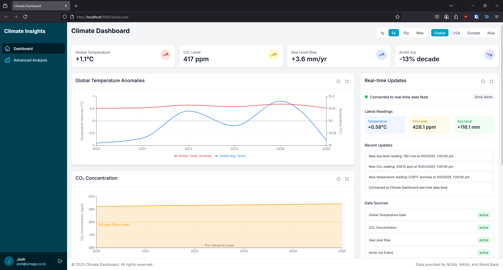

# Climate Dashboard

## Overview

Climate Dashboard is a comprehensive web application for visualizing and monitoring climate data trends. It features interactive charts and maps that display critical climate metrics including global temperature anomalies, CO₂ concentrations, precipitation patterns, sea level rise, and ice extent data.

The project uses a modern React frontend with TypeScript and a Node.js/Express backend. It's designed with real-time data capabilities through WebSockets and includes user authentication to enable personalized dashboards.

## Features

- **Interactive Climate Visualizations**: Temperature trends, CO₂ levels, precipitation patterns
- **Real-time Updates**: WebSocket integration for live climate data feeds
- **Advanced Analytics**: Correlation analysis, heat maps, and geographic visualizations
- **Docker**: Simply clone and docker-compose up to run

## Tech Stack

### Frontend
- React with TypeScript
- Tailwind CSS for styling
- Recharts and D3.js for data visualization
- Socket.io client for real-time communication

### Backend
- Node.js with Express
- MongoDB for data storage
- Redis for caching
- Socket.io for WebSocket server
- JWT for authentication

### DevOps
- Docker and Docker Compose for containerization
- Environment-based configuration